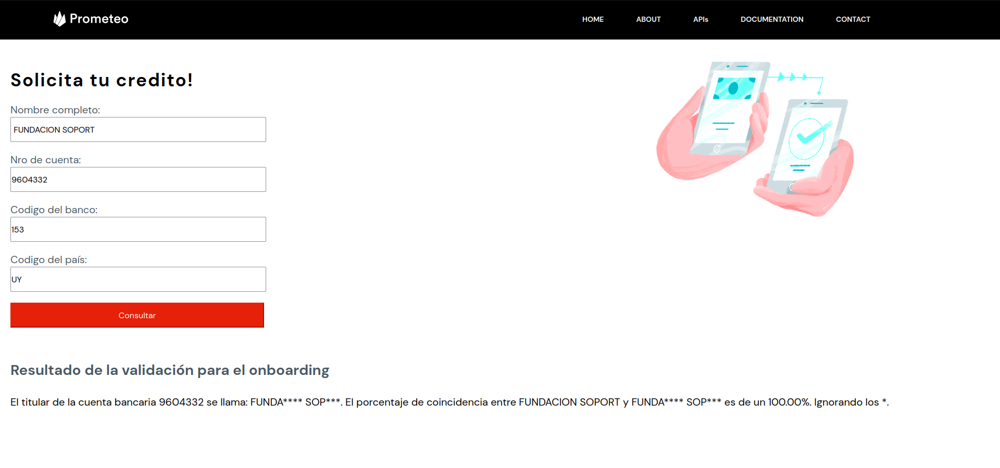
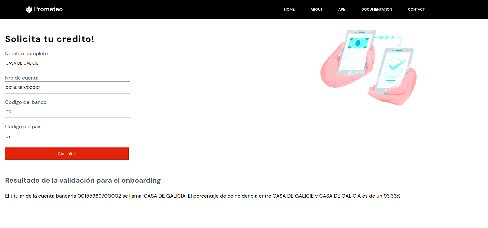

# name-comparator-bank-account

### Run
```
source env/bin/activate
```
```
pip install -r requirements.txt
```
```
cd app
```
```
export FLASK_APP=app
```
```
export FLASK_ENV=development
```
```
flask run
```

### Docu - Examples

*Example 100%*


*Example 93.33%*



